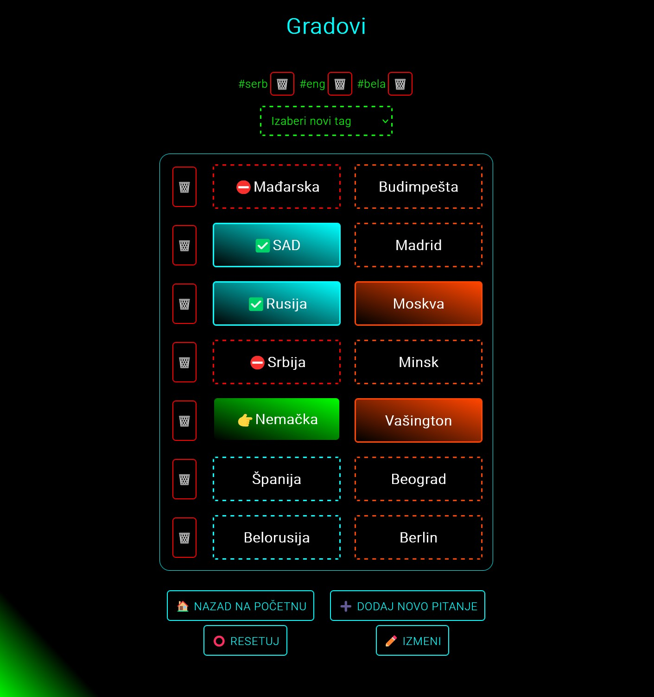

# Testovi Lite edition

[Testovi - Full edition](https://testovi-inc.netlify.app/)
---
[Mihajlo - Portfolio](https://www.mihajlo.engineer/)

Testovi Lite sadrže 3 glavna entiteta: 
- Spojnica
- Pitanje
- Tag

## Spojnica

Posebna JS klasa upravlja prikazom "Pregleda" spojnice na homepage-u, i prikazom i funkcionalnostima same spojnice na posebnoj stranici.

Moguće je dodavati i brisati tagove, menjati naziv i prioritet/težinu spojnice u > Edit modu
Naravno, moguće je dodavati i brisati pitanja iz spojnice. Dodavanje pitanja može biti:
- Novo pitanje, tako što se unesu pitanje i njegov odgovor na licu mesta
- Izbor jednog od svih dostupnih pitanja iz baze a koje već nije deo spojnice

Spojnica se rešava kao u Slagalici, odozgo na dole, pitanej po pitanje a izborom 
odgovarajućeg odgovora iz desne kolone. U zavisnosti od stanja spojnice, tabela
sa pitanjima i odgovorima poprima odgovarajuće stilove nakon svakog rendera.
Klikom na dugme "Reset" moguće je reshufflovati pitanja i odgovore i krenuti iz početka.

Spojnica takođe ima i "NEW mod", u koji ulazi ako se na homepage-u klikne na dugme
"Nova spojnica", tada se unosi naziv i prioritet pre objave spojnice rutom
"Spojnica/DodajSpojnicu" a klikom na dugme "Objavi spojnicu". Nakon objave spojnica
ulazi u regularan mod gde dalje mogu da se unose tagovi i pitanja...

## Pitanja

Pitanje je sastavni deo spojnice ali je moguće interagovati sa njima na homepage-u.
Listu pitanja kontrolišu JS klase za pitanja.
Moguće je dodati novo pitanje, unošenjem pitanja i odgovora na samom vrhu liste sa
pitanjima.
Moguće je unošenje i provera odgovora i prikazivanje tačnog odgovora na svakom
"Pregledu" pitanja i to takođe kontroliše odgovarajuća JS klasa za pitanje.

## Tagovi

Tagovi od atributa imaju samo ID i Title

Na homepage-u imaju posebnu kolonu gde je moguće brisati i dodavati novi tag.
Klikom na svaki od tagova vrši se poziv API metode za preuzimanje samo spojnica
koje sadrže taj tag.

## Ostale funkcionalnosti

Osim filtriranja po tagovima, moguće je i pretraživanje spojnica po imenu.
Search box se nalazi na vrhu homepage-a. Unošenjem pojma i klikom na dugme "Pretraži" poziva se posebna metoda iz SearchController-a i preuzimaju se sve spojnice koje sadrže taj termin u svom imenu.

U odeljku "Podešavanja" moguće je menjati boje:
- Primarnu
- Sekundarnu
- Boju tagova
Pošto su u css-u na svim ključnim mestima umesto hardkodiranih vrednosti korišćene
css varijable, ovu funkcionalnost je vrlo lako implementirati.